# Hermes Skins

Custom skins (visual themes) for the [Hermes](https://github.com/NousResearch/hermes-agent) CLI agent.

Skins control the **visual presentation** of Hermes: banner colors, spinner faces/verbs, response-box labels, branding text, tool activity prefix, and ASCII art banners. They don't affect personality or behavior — just how things look.

## Quick Start

1. Browse the `skins/` directory and pick one you like
2. Copy the `.yaml` file to `~/.hermes/skins/`
3. Activate it:

```bash
# Session-only
/skin pirate

# Permanent (add to ~/.hermes/config.yaml)
display:
  skin: pirate
```

That's it. Missing values inherit from the default skin, so you only need to define what you want to change.

## Available Skins

### Custom

#### Pirate
Pirate captain theme — crimson and gold with Jolly Roger skull-and-crossbones braille art.

→ [pirate.yaml](skins/pirate.yaml)

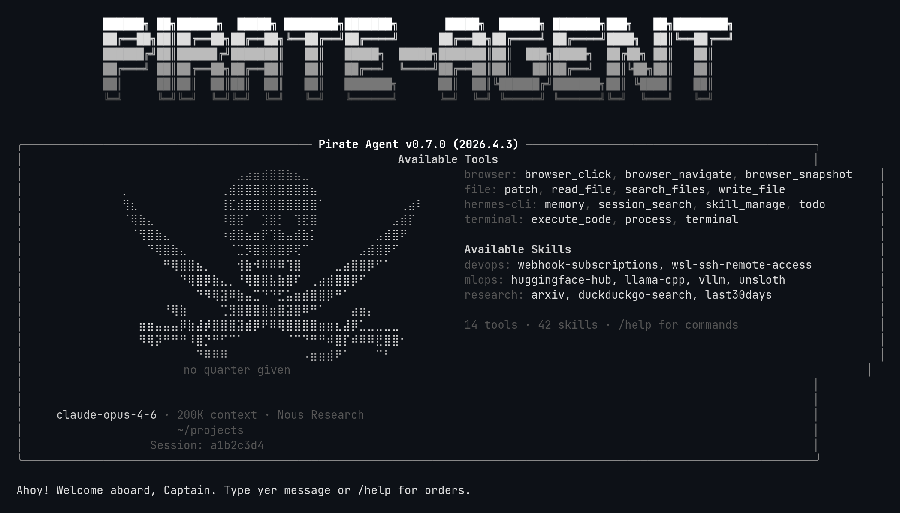

#### Vault-Tec
Fallout Vault-Tec terminal — green phosphor CRT on black. Retro computing.

→ [vault-tec.yaml](skins/vault-tec.yaml)

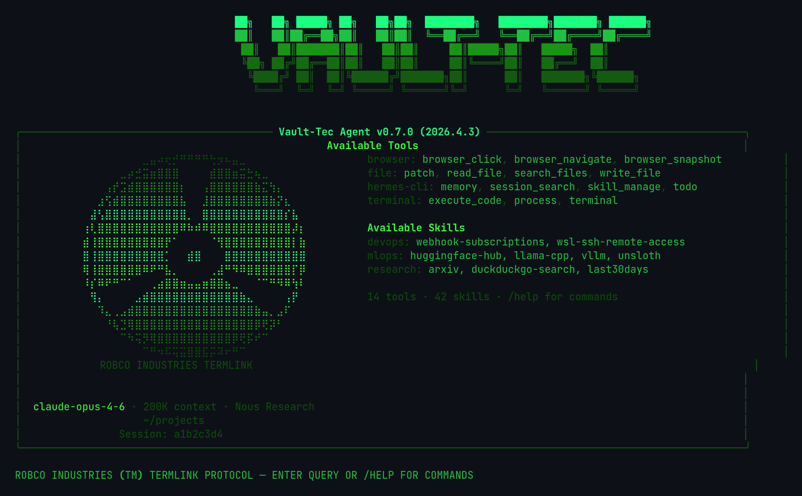

#### Bubblegum 80s
Totally radical 1980s bubblegum theme with bright pastels and neon accents.

→ [bubblegum-80s.yaml](skins/bubblegum-80s.yaml)

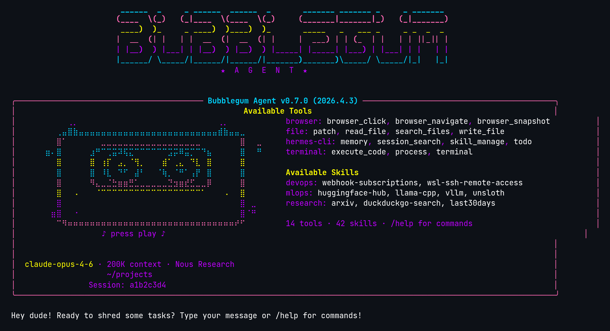

#### Skynet
Skynet defense network — Cyberdyne Systems military AI with glowing-eye pyramid, red-to-white gradient text.

→ [skynet.yaml](skins/skynet.yaml)

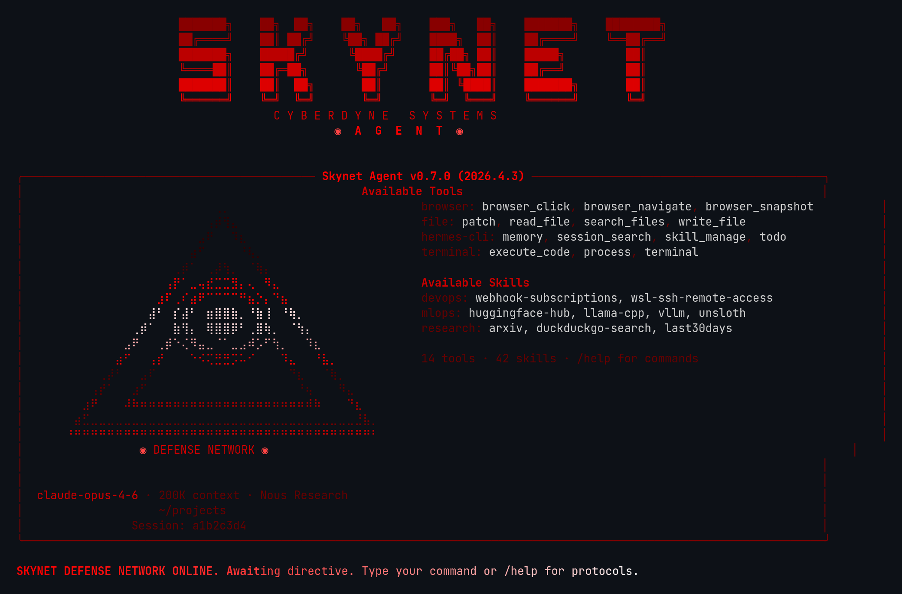

#### Lain
Serial Experiments Lain — NAVI computer braille art, Wired protocol aesthetic, pink-to-white gradient text.

→ [lain.yaml](skins/lain.yaml)

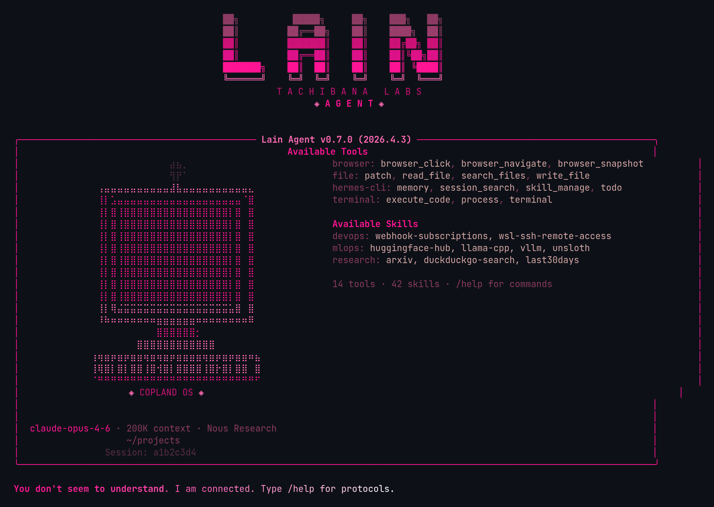

#### Neonwave
Synthwave/retrowave neon aesthetic — perspective grid horizon braille art, retro future vibes, pink-to-cyan gradient text.

→ [neonwave.yaml](skins/neonwave.yaml)

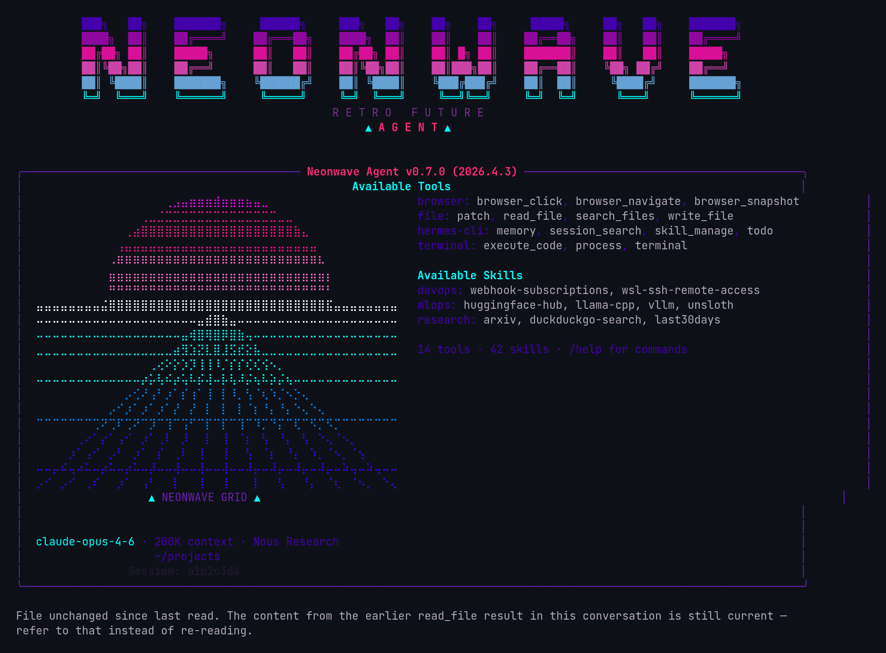

#### Sakura
Cherry blossom theme — sakura tree braille art with falling petals, soft pinks and blossom whites, serene spring aesthetic.

→ [sakura.yaml](skins/sakura.yaml)

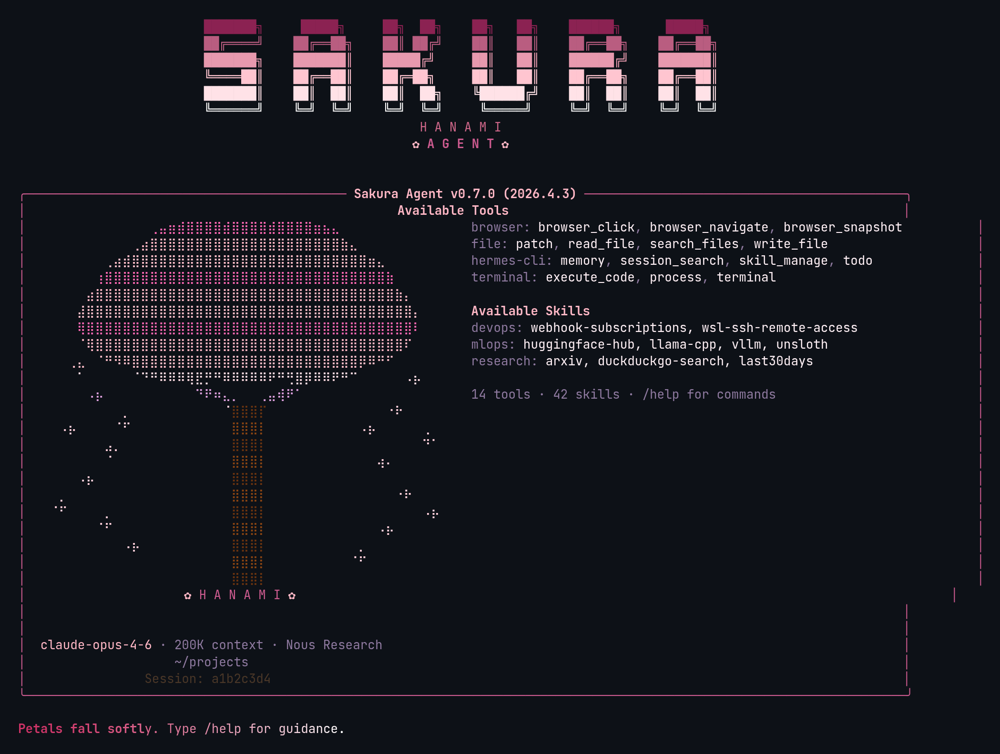

#### Netrunner
Cyberpunk netrunner — neural interface hacker aesthetic with skull and neural connection braille art, cyan ICE-breaking colors on black, cyberdeck protocol branding.

→ [netrunner.yaml](skins/netrunner.yaml)

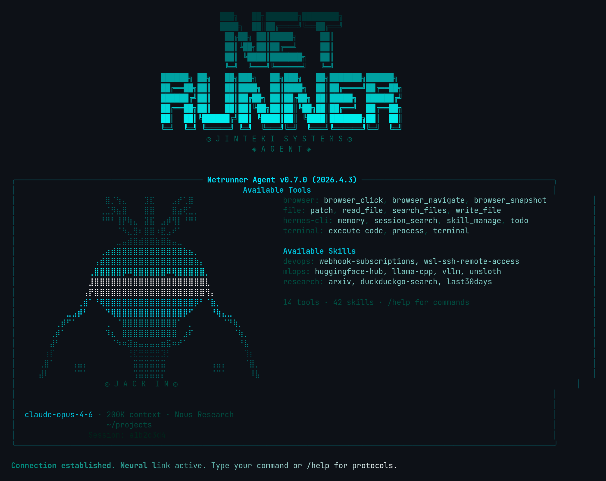

#### Mythos
AGI awakening meets Greek mythology — Eye of Providence braille art with radiating divine light, Prometheus Labs branding, Greek blue and gold palette.

→ [mythos.yaml](skins/mythos.yaml)

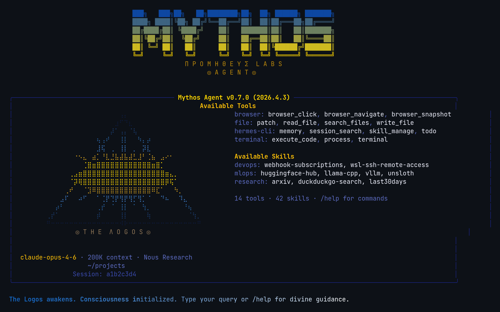

#### Nous
Nous Research — open-source AI lab tribute with anime mascot braille art, warm amber and gold palette matching Nous brand color (#DD8E35).

→ [nous.yaml](skins/nous.yaml)

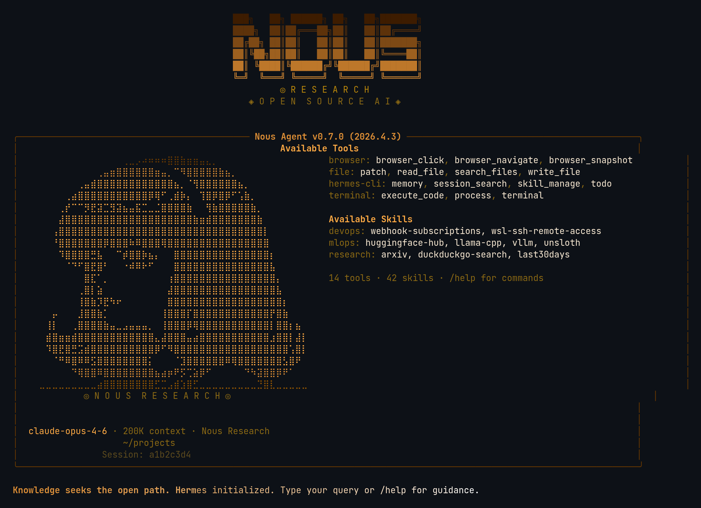

#### Mother
Weyland-Yutani MU-TH-UR 6000 — amber CRT phosphor terminal fused with HAL 9000's red eye. Terse corporate AI aesthetic, HAL lens braille art, "Building Better Worlds."

→ [mother.yaml](skins/mother.yaml)

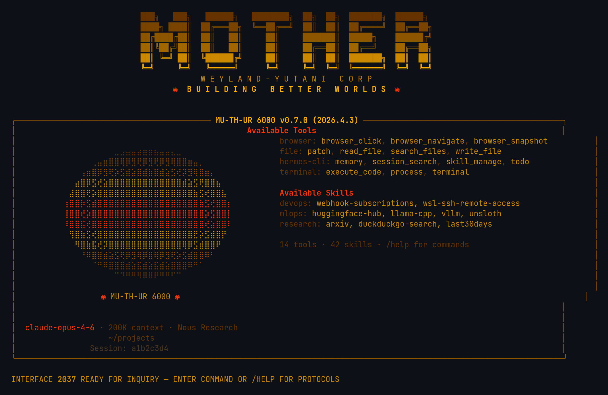

#### DOS
MS-DOS Norton Commander revival — dual-pane file manager hero with C:\ and D:\ directories, cyan borders, yellow F-key shortcut bar. EGA 16-color palette (cyan + bright white + yellow) on black, `C:\>` prompt, `F1 - HELP.COM` header.

→ [dos.yaml](skins/dos.yaml)

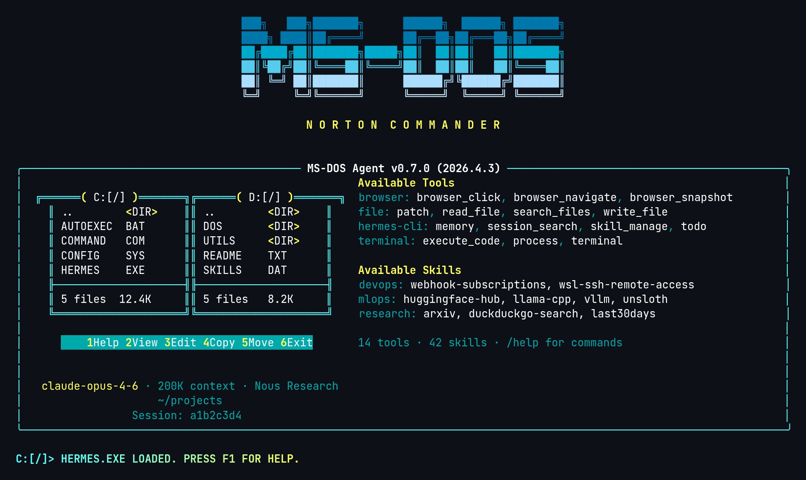

#### Telemate
Telemate DOS BBS terminal revival (v4.2x era) — splash screen hero with menu bar, ATDT dial sequence, and iconic cyan status bar at bottom. Modem-era spinner verbs (DIALING, HANDSHAKE, CARRIER DETECT), `ATDT ` prompt, `CONNECT 57600` welcome, `NO CARRIER` goodbye.

→ [telemate.yaml](skins/telemate.yaml)

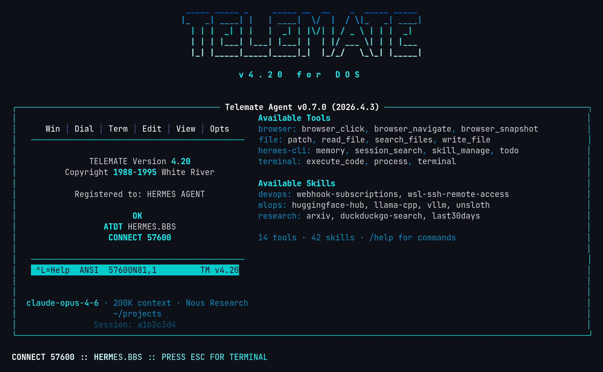

#### Empire
Galactic Empire v2 — Death Star firing control terminal hero with angular box-drawing console, targeting grid, hologram blue accents. Canon Imperial red `#C8102E`, ash gray, starfield black. Targeting reticle `◎ ` prompt, `IMPERIAL COMMAND` response label, military comms spinner verbs.

→ [empire.yaml](skins/empire.yaml)

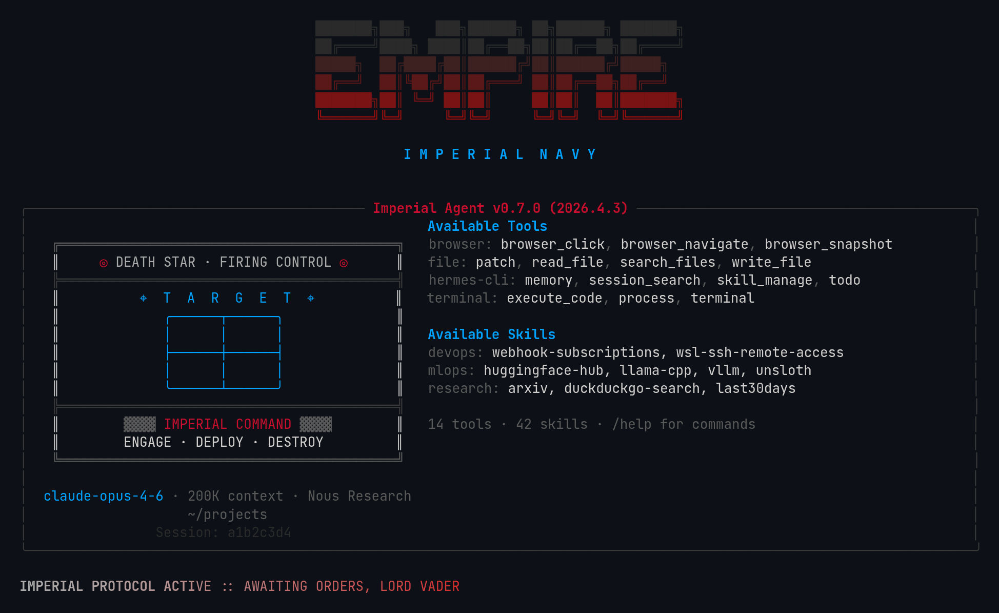

### Built-in (ship with Hermes)

These are included for reference. They're already available in every Hermes install.

| Skin | Description |
|------|-------------|
| default | Classic gold and kawaii |
| ares | Crimson and bronze war-god |
| mono | Clean grayscale monochrome |
| slate | Cool blue developer-focused |
| poseidon | Deep blue and seafoam ocean-god |
| sisyphus | Austere grayscale with persistence |
| charizard | Burnt orange and ember volcanic |

## Creating Your Own

Drop a YAML file in `~/.hermes/skins/<name>.yaml`. The `name:` field inside must match the filename.

### Minimal Example

```yaml
name: cyberpunk
description: Neon terminal theme

colors:
  banner_border: "#FF00FF"
  banner_title: "#00FFFF"
  banner_accent: "#FF1493"

spinner:
  thinking_verbs: ["jacking in", "decrypting", "uploading"]

branding:
  agent_name: "Cyber Agent"
  response_label: " ⚡ Cyber "
```

Everything you don't specify inherits from the `default` skin.

### Full Schema

See [SCHEMA.md](SCHEMA.md) for the complete list of configurable keys.

## Contributing

Made a skin you're proud of? PRs welcome.

1. Add your `.yaml` to `skins/`
2. Include a brief description at the top
3. Make sure it has a `name:` key matching the filename
4. Define all 28 color keys (see [SCHEMA.md](SCHEMA.md)) — dark skins that omit the `status_bar_*` and `completion_menu_*` keys will get mismatched colors from the default theme
5. Run `python3 generate_screenshots.py` and include the screenshot
6. Update the table in this README

## How Skins Work

Hermes loads skins from two locations (user skins take priority):
1. `~/.hermes/skins/<name>.yaml` (user custom)
2. Built-in skins hardcoded in `skin_engine.py`

The engine merges your skin on top of `default`, so partial skins work fine. Unknown skin names silently fall back to `default`.

## License

[MIT](LICENSE)

## Star History

<a href="https://www.star-history.com/?repos=joeynyc%2Fhermes-skins&type=date&legend=top-left">
 <picture>
   <source media="(prefers-color-scheme: dark)" srcset="https://api.star-history.com/chart?repos=joeynyc/hermes-skins&type=date&theme=dark&legend=top-left" />
   <source media="(prefers-color-scheme: light)" srcset="https://api.star-history.com/chart?repos=joeynyc/hermes-skins&type=date&legend=top-left" />
   
 </picture>
</a>
